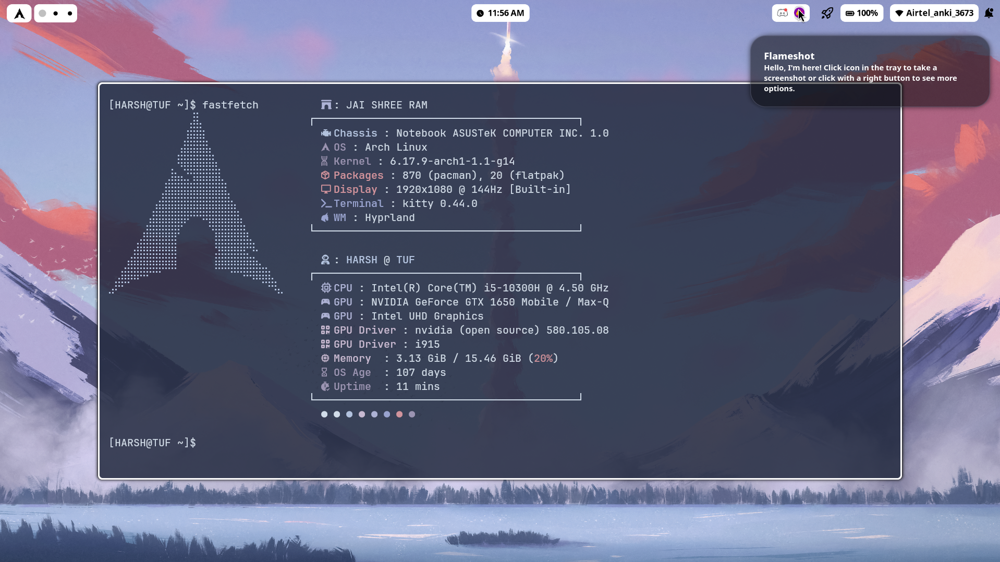
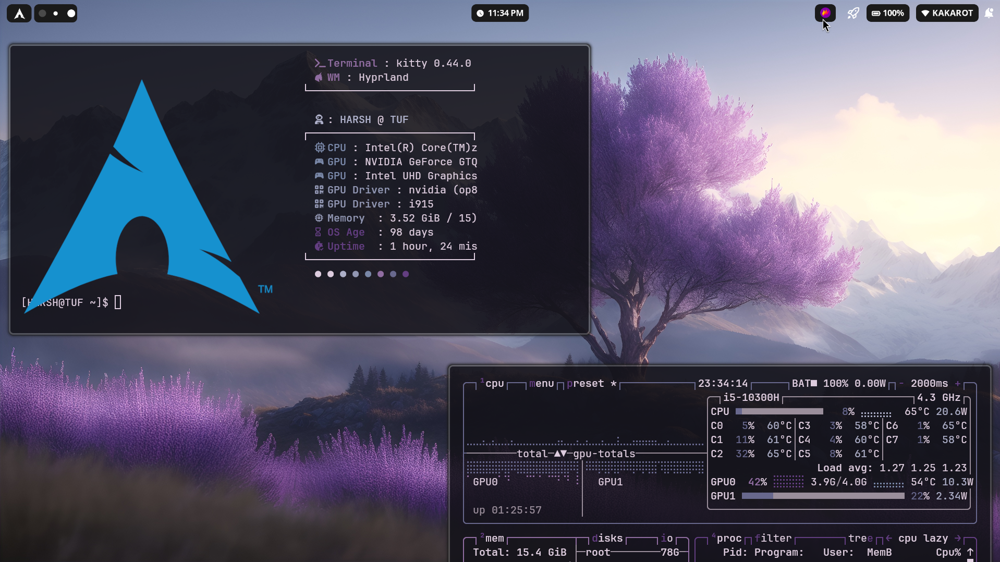

# 🌌 Arch Linux Hyprland Setup (ASUS TUF F15)

> **A high-performance hybrid graphics setup using Arch Linux, Hyprland (Wayland), Prime-run on the ASUS TUF F15.**

<p align="center">
  
</p>

  

## 💻 Hardware Specifications
*   **Device:** ASUS TUF Gaming F15
*   **CPU:** Intel Core i5 (Comet Lake-H)
*   **GPU-0 (Integrated):** Intel UHD Graphics 630 (CometLake-H GT2) - *Drives Internal Display*
*   **GPU-1 (Discrete):** NVIDIA GeForce GTX 1650 Mobile / Max-Q - *Render Offload & External HDMI*
*   **Bootloader:** `systemd-boot`

***

## ⚙️ System Installation & Core Config

### 1. Bootloader (systemd-boot)
Unlike GRUB, this setup uses `systemd-boot`. The kernel parameters are crucial for preventing boot freezes and ensuring the NVIDIA driver loads with DRM KMS support.

**File:** `/boot/loader/entries/arch.conf`
```ini
title   Arch Linux
linux   /vmlinuz-linux
initrd  /intel-ucode.img
initrd  /initramfs-linux.img
options root=UUID=YOUR_ROOT_UUID rw quiet splash ibt=off nvidia_drm.modeset=1 nvidia_drm.fbdev=1 i915.modeset=1
```
*   `nvidia_drm.modeset=1`: Enables kernel mode setting for NVIDIA (required for Wayland).[1]
*   `i915.modeset=1`: Ensures Intel iGPU loads correctly for the internal display.

### 2. Initramfs Modules
Early loading of NVIDIA modules is required to prevent SDDM from launching before the GPU is ready.

## 🔒 Security & Disk Encryption [LVM on LUKS](https://wiki.archlinux.org/title/Dm-crypt/Encrypting_an_entire_system#LVM_on_LUKS)

This setup provides full disk encryption (LUKS) for security and uses Logical Volume Management (LVM) for flexible partition resizing. This is typically done before partitioning and formatting.
### A. Disk Encryption (LUKS)

This step encrypts the entire partition where your LVM volumes will reside (excluding /boot/efi).

### B. Logical Volume Management (LVM)

Once the LUKS volume is open, you create the LVM structure inside the decrypted container.

***

## 🎨 Graphics & Display Manager

### 1. Hybrid Graphics Strategy
This setup uses `prime-run` to handle GPU power switching, with for on-demand offloading.

### 2. SDDM (Login Screen)
We use SDDM with the Qt6 Wayland backend. A specific configuration is needed to ensure the greeter appears on the laptop screen (Intel) rather than getting stuck on the external monitor or a black screen.

## 🖼️ Hyprland Configuration

Modular Dotfiles for clean config code

<p align="center">
  
</p>

### Environment Variables
Essential for preventing flickering, cursor disappearance, and ensuring apps use the NVIDIA GPU when requested.

```ini
# NVIDIA Specific
env = LIBVA_DRIVER_NAME,nvidia
env = XDG_SESSION_TYPE,wayland
env = GBM_BACKEND,nvidia-drm
env = __GLX_VENDOR_LIBRARY_NAME,nvidia
env = WLR_NO_HARDWARE_CURSORS,1  # Fixes invisible cursor

# Qt/Wayland
env = QT_QPA_PLATFORM,wayland
env = QT_WAYLAND_SHELL_INTEGRATION,layer-shell

# GPU Selection (Forces Hyprland to see NVIDIA card)
env = WLR_DRM_DEVICES,/dev/dri/card0:/dev/dri/card1
```


## 📦 Essential Packages
*   **Compositor:** `hyprland`, `xdg-desktop-portal-hyprland`
*   **Graphics:** `nvidia`, `nvidia-utils`, `nvidia-settings`, `optimus-manager` (AUR), `qt6-wayland`
*   **Terminal:** `kitty`
*   **Launcher:** `wofi` or `rofi-wayland`
*   **Bar:** `waybar`

***

## 🔗 References & Resources
*   [Arch Wiki: Hyprland](https://wiki.archlinux.org/title/Hyprland) 
*   [Arch Wiki: NVIDIA](https://wiki.archlinux.org/title/NVIDIA) 
*   [Hyprland Wiki: NVIDIA Guide](https://wiki.hyprland.org/Nvidia/)
*   [Prime-run](https://wiki.archlinux.org/title/PRIME)
